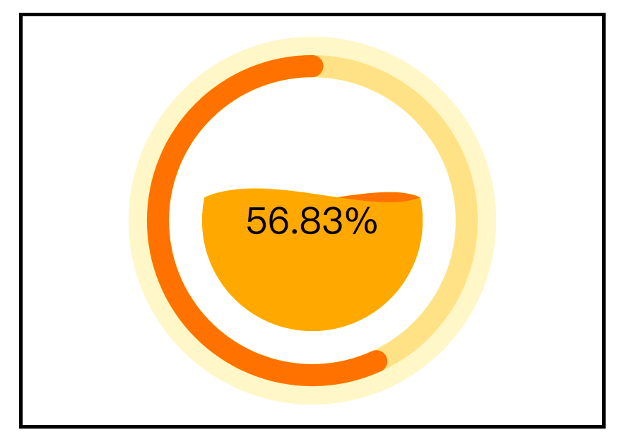

# process-wave
一个圆形水波进度图。

<p align='center'></p>

<p>
  <a href="https://hai2007.gitee.io/npm-downloads?interval=7&packages=@clunch/process-wave"></a>
  <a href="https://www.npmjs.com/package/@clunch/process-wave"></a>
  <a href="https://github.com/clunch-contrib/process-wave/graphs/commit-activity" target='_blank'></a>
  <a href="https://github.com/clunch-contrib/process-wave/blob/master/LICENSE"></a>
  <a href="https://github.com/clunch-contrib/process-wave" target='_blank'></a>
</p>

## 如何使用？

首先，需要安装npm包（目前我们仅支持npm方式管理）：

```
npm install --save clunch @clunch/process-wave
```

然后注册组件：

```js
import Clunch from 'clunch';
import processWave from '@clunch/process-wave';

Clunch.series('ui-process-wave',processWave);
```

然后，你就可以使用这个组件了：

```html
<ui-process-wave process='number'/>
```

- process:进度（闭区间0~1，比如0.5）

除了上面的必输项外，还有下列可选项：

|属性|类型|描述|默认值|可选值|
|----|----|----|----|----|
|cx|number|图形中心位置横坐标|||
|cy|number|图形中心位置纵坐标|0||
|radius|number|图形半径|画布最小边的一半||
|deep|number|动画进度|0.25|0~1|

由于此组件是基于[Clunch](https://github.com/hai2007/clunch)开发的，我们默认你已经掌握了相关知识。

[<< 你可以点击此处学习Clunch.js如何使用](https://hai2007.gitee.io/clunch/#/course/introduce?fixed=top)

开源协议
---------------------------------------
[MIT](https://github.com/clunch-contrib/process-wave/blob/master/LICENSE)

Copyright (c) 2021 [hai2007](https://hai2007.gitee.io/sweethome/) 走一步，再走一步。
